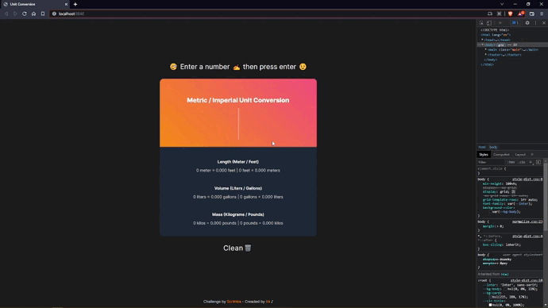
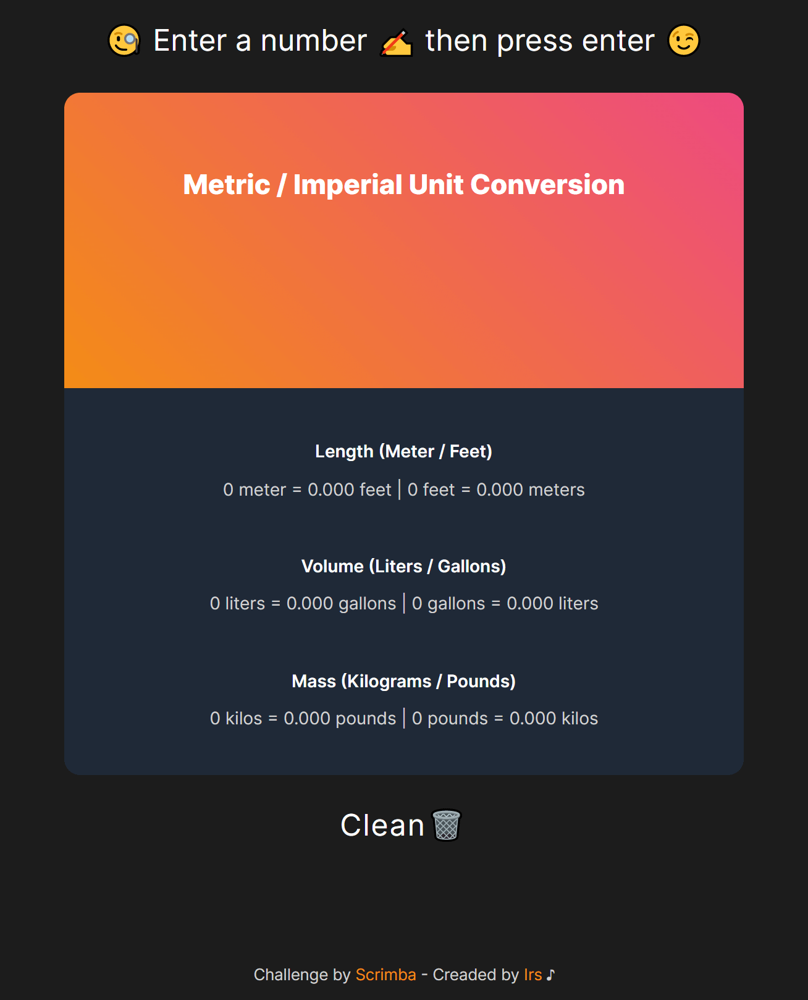

# Scrimba - Solo Project -> Unit Converter

Hi 👋

This is a solution to the [Solo Project - Unit Converter](https://scrimba.com/learn/learnjavascript/module-32-solo-project-unit-converter-c2g86PSZ). 

If you liked my solution, give me 🌟. Thank you 😉

## Table of contents

  - [Requirements](#requirements)
  - [Screenshot](#screenshot)
  - [Link](#link)
  - [Built with](#built-with)
  - [Author](#author)

## Requirements

✅ Save number to a variable in code

✅ When app loads, do calculations and display the results

✅ Round numbers to 3 decimal places

✅ Stretch: Add an input for the user to change the number and automatically recalculate values when it changes

## Screenshot

## Link

- [Live](https://irs-mp.github.io/unit-converter/) 👀

## Built with

- Mobile-first workflow
- Semantic HTML5 markup
- CSS custom properties
- Flexbox
- CSS Grid

## Author

- Frontend Mentor - [@Irs-mp](https://www.frontendmentor.io/profile/Irs-mp)
- Twitter - [@Irs_mp](https://twitter.com/Irs_mp)
